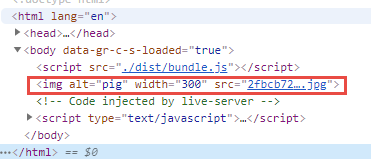
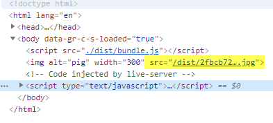
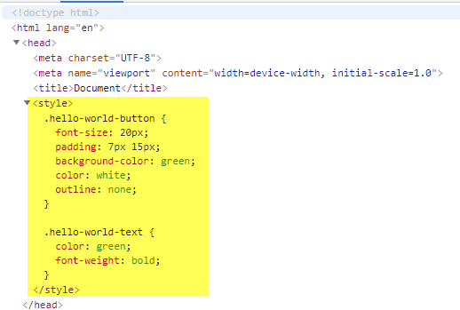
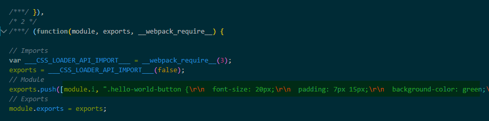
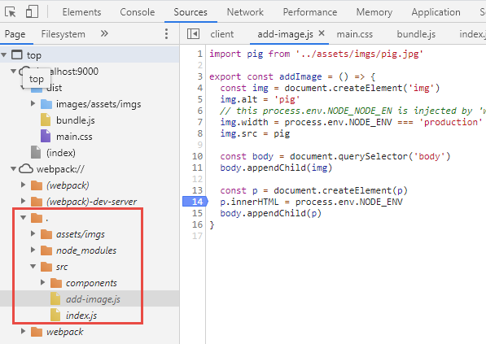
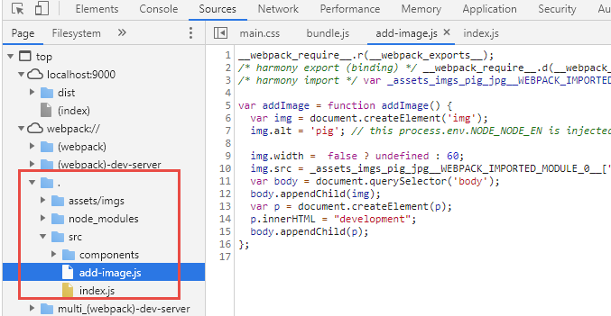

#### 2. Initial Setup and Integrating Webpack

##### 2.2. Setting Up Our Application

initial it is a plain old html project

```
/
│  index.html
│  package.json
│  README.md
│
└─ /src
        hello-world.js
        index.js

```

./index.html

```html
<!DOCTYPE html>
<html lang="en">
  <head>
    <meta charset="UTF-8" />
    <meta name="viewport" content="width=device-width, initial-scale=1.0" />
    <title>Document</title>
  </head>
  <body>
    <script src="./src/hello-world.js"></script>
    <script src="./src/index.js"></script>
  </body>
</html>
```

./src/hello-world.js

```js
function helloWorld() {
  console.log('Hello World')
}
```

./src/index.js

```js
helloWorld()
```

Problem is, we have to remember the oder of the JavaScript files, the `hello-world.js` has to be put before `index.js`. If you have more js files, it will be a nightmare.

##### 2.3. Install Webpack And Integrate It With NPM

To install webpack

```
npm i -D webpack webpack-cli
```

and create a simple webpack configuration file.
./webpack.config.js

```js
module.exports = {
  entry: './src/index.js',
  output: {
    filename: 'bundle.js',
    path: './dist'
  },
  mode: 'none'
}
```

for mode, we put "none" for now

##### 2.5. Integrating Webpack Into Our JS Application

Now we update our html file to use the bundled js file

./index.html

```js
<!DOCTYPE html>
<html lang="en">
  <head>
    <meta charset="UTF-8" />
    <meta name="viewport" content="width=device-width, initial-scale=1.0" />
    <title>Document</title>
  </head>
  <body>
    <script src="./dist/bundle.js"></script>
  </body>
</html>
```

and ./src/index.js as an entry point, has to include other JavaScript files
./src/index.js

```js
import { helloWorld } from './hello-world'

helloWorld()
```

./src/hello-world.js

```js
export const helloWorld = () => {
  console.log('Hello World')
}
```

Now if we run `npm run build`, we will get an error:

```
Invalid configuration object. Webpack has been initialised using a configuration object that does not match the API schema.
 - configuration.output.path: The provided value "./dist" is not an absolute path!
   -> The output directory as **absolute path** (required).
```

This is because the 'output.path' must be a absolute path

```js
const path = require('path')

module.exports = {
  entry: './src/index.js',
  output: {
    filename: 'bundle.js',
    path: path.resolve(__dirname, './dist')
  },
  mode: 'none'
}
```

If you run `npm run build` again, you will see a success result

```
Hash: f7cd397a6c3b8eb6d862
Version: webpack 4.42.0
Time: 72ms
Built at: 03/21/2020 5:33:47 PM
    Asset      Size  Chunks             Chunk Names
bundle.js  4.15 KiB       0  [emitted]  main
Entrypoint main = bundle.js
[0] ./src/index.js 60 bytes {0} [built]
[1] ./src/hello-world.js 68 bytes {0} [built]
```

#### 3. Loaders

##### 3.1. What Is Webpack Loader

With Webpack, you can import JavaScript, CSS, Sass, Less, Handlebar, and lot more

##### 3.2. Handling Images With Webpack

Now we try to load an image file using Webpack

We created a new js file, called add-image.js
./src/add-image.js

```js
import pig from '../assets/imgs/pig.jpg'

export const addImage = () => {
  const img = document.createElement('img')
  img.alt = 'pig'
  img.width = 300
  img.src = pig

  const body = document.querySelector('body')
  body.appendChild(img)
}
```

And import it from index.js
./src/index.js

```js
import { helloWorld } from './hello-world'
import { addImage } from './add-image'

helloWorld()
addImage()
```

Now we run Webpack, we will see below error:

```
ERROR in ./assets/imgs/pig.jpg 1:0
Module parse failed: Unexpected character '�' (1:0)
You may need an appropriate loader to handle this file type, currently no loaders are configured to process this file. See https://webpack.js.org/concepts#loaders
(Source code omitted for this binary file)
 @ ./src/add-image.js 1:0-40 7:12-15
 @ ./src/index.js
```

This is because Webpack does NOT know how to deal with files other than JavaScript files
We need to setup rules for Webpack to load different types of files

webpack.config.js

```js
const path = require('path')

module.exports = {
  entry: './src/index.js',
  output: {
    filename: 'bundle.js',
    path: path.resolve(__dirname, './dist')
  },
  mode: 'none',
  // please setup rules for me, how to load files other than Js files
  module: {
    // if see .png or .jpg files, use 'file-loader'
    rules: [{ test: /\.(png|jpg)$/, use: ['file-loader'] }]
  }
}
```

And `file-load` is a separate npm package

Install `npm i -D file-loader`

Now if you run `npm run build` then problem solved

```
Hash: 92879cb1c4379eab2f9b
Version: webpack 4.42.0
Time: 142ms
Built at: 03/21/2020 6:27:42 PM
                               Asset      Size  Chunks             Chunk Names
2fbcb72217d6eb574dadea2e0268c5d3.jpg  62.5 KiB          [emitted]
                           bundle.js  5.18 KiB       0  [emitted]  main
Entrypoint main = bundle.js
[0] ./src/index.js 112 bytes {0} [built]
[1] ./src/hello-world.js 68 bytes {0} [built]
[2] ./src/add-image.js 254 bytes {0} [built]
[3] ./assets/imgs/pig.jpg 80 bytes {0} [built]
```

An more complex usage

```js
      // if see .png or .jp(e)g, gif files, use 'file-loader'
      {
        test: /\.(png|jpe?g|gif)$/i,
        loader: 'file-loader',
        options: {
          outputPath: 'images',
          name(resourcePath, resourceQuery) {
            // `resourcePath` - `/absolute/path/to/file.js`
            // `resourceQuery` - `?foo=bar`

            if (process.env.NODE_ENV === 'development') {
              return '[path][name].[ext]'
            }

            return '[contenthash].[ext]'
          }
        }
      },
```

However the image is not displayed properly. This is because missing of a public path


##### 3.3. Handling Images With Webpack. How To Use publicPath.mp4

We need to tell the public path of the bundled files, in `output.publicPath`

```js
const path = require('path')

module.exports = {
  entry: './src/index.js',
  output: {
    filename: 'bundle.js',
    path: path.resolve(__dirname, './dist'),
    // Where you uploaded your bundled files. (Relative to server root)
    publicPath: '/dist/'
  },
  mode: 'none',
  // please setup rules for me, how to load files other than Js files
  module: {
    // if see .png or .jpg files, use 'file-loader'
    rules: [{ test: /\.(png|jpg)$/, use: ['file-loader'] }]
  }
}
```

Now if run `npm run build` then problem solved


##### 3.4. Handling CSS With Webpack

Now we create a new js file, which requires a CSS file
./src/components/hello-world-button/hello-world-button.js

```js
import './hello-world-button.css'

export default class HelloWorldButton {
  render() {
    const button = document.createElement('button')
    button.innerHTML = 'Hello World'
    button.classList.add('hello-world-button')
    const body = document.querySelector('body')
    button.onclick = () => {
      const p = document.createElement('p')
      p.innerHTML = 'Hello World'
      p.classList.add('hello-world-text')
      body.appendChild(p)
    }
    body.appendChild(button)
  }
}
```

./src/index.js

```js
import HelloWorldButton from './components/hello-world-button/hello-world-button'

const helloWorldButton = new HelloWorldButton()
helloWorldButton.render()
```

When you build, you will see below error:

```
ERROR in ./src/components/hello-world-button/hello-world-button.css 1:0
Module parse failed: Unexpected token (1:0)
You may need an appropriate loader to handle this file type, currently no loaders are configured to process this file. See https://webpack.js.org/concepts#loaders
> .hello-world-button {
|   font-size: 20px;
|   padding: 7px 15px;
 @ ./src/components/hello-world-button/hello-world-button.js 1:0-33
 @ ./src/index.js
```

TO load CSS properly, we will need `css-loader`, and optional `style-loader`

```
npm i -D css-loader style-loader
```

##### Optional 1:using css-loader with style loader

Now if you use css-loader with style loader, bundle is working fine. The css style will be inject into the header of the index.html file

```js
const path = require('path')

module.exports = {
  entry: './src/index.js',
  output: {
    filename: 'bundle.js',
    path: path.resolve(__dirname, './dist'),
    // Where you uploaded your bundled files. (Relative to server root)
    publicPath: '/dist/'
  },
  mode: 'none',
  // please setup rules for me, how to load files other than Js files
  module: {
    // if see .png or .jpg files, use 'file-loader'
    rules: [
      { test: /\.(png|jpg)$/, use: ['file-loader'] },
      { test: /\.css$/, use: ['style-loader', 'css-loader'] }
    ]
  }
}
```

Now if run `npm run build`


##### Optional 2: using css-loader ONLY

Now if you use css-loader alone, the css content will be bundled into js file

```js
const path = require('path')

module.exports = {
  entry: './src/index.js',
  output: {
    filename: 'bundle.js',
    path: path.resolve(__dirname, './dist'),
    // Where you uploaded your bundled files. (Relative to server root)
    publicPath: '/dist/'
  },
  mode: 'none',
  // please setup rules for me, how to load files other than Js files
  module: {
    // if see .png or .jpg files, use 'file-loader'
    rules: [
      { test: /\.(png|jpg)$/, use: ['file-loader'] },
      { test: /\.css$/, use: ['css-loader'] }
    ]
  }
}
```

Now if run `npm run build`


##### Optional 3: To export css into a separate file, we need mini-css-extract-plugin plugin

See below [4.3. Extracting CSS Into a Separate Bundle With mini-css-extract-plugin](#mini-css-extract-plugin)

##### 3.5. Handling SASS

let's rename the css filet to scss file

```scss
$font-size: 20px;
$button-background-color: green;

.hello-world-button {
  font-size: $font-size;
  padding: 7px 15px;
  background-color: $button-background-color;
  color: white;
  outline: none;
}

.hello-world-text {
  color: $button-background-color;
  font-weight: bold;
}
```

and change the reference in js file

```js
import './hello-world-button.scss'

export default class HelloWorldButton {
  render() {
    const button = document.createElement('button')
    button.innerHTML = 'Hello World'
    button.classList.add('hello-world-button')
    const body = document.querySelector('body')
    button.onclick = () => {
      const p = document.createElement('p')
      p.innerHTML = 'Hello World'
      p.classList.add('hello-world-text')
      body.appendChild(p)
    }
    body.appendChild(button)
  }
}
```

Now when you run `npm run build`, you will get an error:

```
ERROR in ./src/components/hello-world-button/hello-world-button.js
Module not found: Error: Can't resolve './hello-world-button.scss' in 'C:\Users\Jeremy\Desktop\Webpack4-in-2020\src\components\hello-world-button'
 @ ./src/components/hello-world-button/hello-world-button.js 1:0-34
 @ ./src/index.js
```

To load sass file, you will need `sass-loader node-sass`

install:

```
npm i -D sass-loader node-sass
```

Then add an new rule for .sass or .scss file

```js
const path = require('path')
const MiniCssExtractPlugin = require('mini-css-extract-plugin')

const devMode = process.env.NODE_ENV !== 'production'

module.exports = {
  entry: './src/index.js',
  output: {
    filename: 'bundle.js',
    path: path.resolve(__dirname, './dist'),
    // Where you uploaded your bundled files. (Relative to server root)
    publicPath: '/dist/'
  },
  mode: 'none',
  plugins: [
    new MiniCssExtractPlugin({
      // Options similar to the same options in webpackOptions.output
      // both options are optional
      filename: devMode ? '[name].css' : '[name].[hash].css',
      chunkFilename: devMode ? '[id].css' : '[id].[hash].css'
    })
  ],
  // please setup rules for me, how to load files other than Js files
  module: {
    // if see .png or .jpg files, use 'file-loader'
    rules: [{ test: /\.(png|jpg)$/, use: ['file-loader'] }],
    rules: [
      {
        test: /\.css$/,
        use: [
          {
            loader: MiniCssExtractPlugin.loader,
            options: {
              hmr: process.env.NODE_ENV === 'development'
            }
          },
          'css-loader'
        ]
      },
      {
        test: /\.s[ac]ss$/i,
        use: [
          {
            loader: MiniCssExtractPlugin.loader,
            options: {
              hmr: process.env.NODE_ENV === 'development'
            }
          },
          // Translates CSS into CommonJS
          'css-loader',
          // Compiles Sass to CSS
          'sass-loader'
        ]
      }
    ]
  }
}
```

##### 3.6. Using Latest JavaScript Features With Babel 7

Some new JavaScript features are not supported by most of Web Browsers. To solve that, we can use Webpack and `babel-loader` to transpile that into ES5 code

For example we add in some non-function Class Property

```js
import './hello-world-button.scss'

export default class HelloWorldButton {
  buttonCssClass = 'hello-world-button'
  render() {
    const button = document.createElement('button')
    button.innerHTML = 'Hello World'
    button.classList.add(this.buttonCssClass)
    const body = document.querySelector('body')
    button.onclick = () => {
      const p = document.createElement('p')
      p.innerHTML = 'Hello World'
      p.classList.add('hello-world-text')
      body.appendChild(p)
    }
    body.appendChild(button)
  }
}
```

if you run `npm run build`, you will get below error:

```
ERROR in ./src/components/hello-world-button/hello-world-button.js 4:17
Module parse failed: Unexpected token (4:17)
You may need an appropriate loader to handle this file type, currently no loaders are configured to process this file. See https://webpack.js.org/concepts#loaders
|
| export default class HelloWorldButton {
>   buttonCssClass = 'hello-world-button'
|   render() {
|     const button = document.createElement('button')
 @ ./src/index.js 1:0-81 3:29-45
```

We need to install and config `babel-loader`

```
npm i -D @babel/core @babel/preset-env babel-plugin-transform-class-properties babel-loader
```

and we need to create a new rule for js files

```js
const path = require('path')
const MiniCssExtractPlugin = require('mini-css-extract-plugin')

const devMode = process.env.NODE_ENV !== 'production'

module.exports = {
  entry: './src/index.js',
  output: {
    filename: 'bundle.js',
    path: path.resolve(__dirname, './dist'),
    // Where you uploaded your bundled files. (Relative to server root)
    publicPath: '/dist/'
  },
  mode: 'none',
  plugins: [
    new MiniCssExtractPlugin({
      // Options similar to the same options in webpackOptions.output
      // both options are optional
      filename: devMode ? '[name].css' : '[name].[hash].css',
      chunkFilename: devMode ? '[id].css' : '[id].[hash].css'
    })
  ],
  // please setup rules for me, how to load files other than Js files
  module: {
    rules: [
      {
        test: /\.js$/,
        exclude: /node_modules/,
        use: {
          loader: 'babel-loader',
          options: {
            presets: ['@babel/env'],
            plugins: ['transform-class-properties']
          }
        }
      },
      // if see .png or .jpg files, use 'file-loader'
      { test: /\.(png|jpg)$/, use: ['file-loader'] },
      {
        test: /\.css$/,
        use: [
          {
            loader: MiniCssExtractPlugin.loader,
            options: {
              hmr: process.env.NODE_ENV === 'development'
            }
          },
          'css-loader'
        ]
      },
      {
        test: /\.s[ac]ss$/i,
        use: [
          {
            loader: MiniCssExtractPlugin.loader,
            options: {
              hmr: process.env.NODE_ENV === 'development'
            }
          },
          // Translates CSS into CommonJS
          'css-loader',
          // Compiles Sass to CSS
          'sass-loader'
        ]
      }
    ]
  }
}
```

#### 4. Plugins

Plugins are additional JavaScript libraries that do everything that loader cannot do.
Plugins can also modify how the bundles themselves are created. For example, uglifyJSPlugin takes the bundle.js, and minimizes the contents to decrease the bundle size.

##### 4.2. Minification Of The Resulting Webpack Bundle

We use `terser-webpack-plugin` for minification. It it recommended nowadays, but still you can use `uglifyJSPlugin` if you prefer

Install

```
npm i -D terser-webpack-plugin
```

In webpack.config.js, we need to import it, then create a section `optimization`

```js
const path = require('path')
const MiniCssExtractPlugin = require('mini-css-extract-plugin')
const TerserPlugin = require('terser-webpack-plugin')

const devMode = process.env.NODE_ENV !== 'production'

module.exports = {
  entry: './src/index.js',
  output: {
    filename: 'bundle.js',
    path: path.resolve(__dirname, './dist'),
    // Where you uploaded your bundled files. (Relative to server root)
    publicPath: '/dist/'
  },
  mode: 'none',
  plugins: [
    new MiniCssExtractPlugin({
      // Options similar to the same options in webpackOptions.output
      // both options are optional
      filename: devMode ? '[name].css' : '[name].[hash].css',
      chunkFilename: devMode ? '[id].css' : '[id].[hash].css'
    })
  ],
  // for minification
  optimization: {
    minimize: true,
    minimizer: [new TerserPlugin({ sourceMap: true })]
  },
  // please setup rules for me, how to load files other than Js files
  module: {
    rules: [
      {
        test: /\.js$/,
        exclude: /node_modules/,
        use: {
          loader: 'babel-loader',
          options: {
            presets: ['@babel/env'],
            plugins: ['transform-class-properties']
          }
        }
      },
      // if see .png or .jpg files, use 'file-loader'
      { test: /\.(png|jpg)$/, use: ['file-loader'] },
      {
        test: /\.css$/,
        use: [
          {
            loader: MiniCssExtractPlugin.loader,
            options: {
              hmr: process.env.NODE_ENV === 'development'
            }
          },
          'css-loader'
        ]
      },
      {
        test: /\.s[ac]ss$/i,
        use: [
          {
            loader: MiniCssExtractPlugin.loader,
            options: {
              hmr: process.env.NODE_ENV === 'development'
            }
          },
          // Translates CSS into CommonJS
          'css-loader',
          // Compiles Sass to CSS
          'sass-loader'
        ]
      }
    ]
  }
}
```

Now if you run `npm run build`, the size of the bundle.js is changed from 6kb to 1.77kb

##### 4.3. Extracting CSS Into a Separate Bundle With mini-css-extract-plugin

<a name="mini-css-extract-plugin">Extracting CSS Into a Separate Bundle With mini-css-extract-plugin</a>

Install

```
npm install --save-dev mini-css-extract-plugin
```

For configuration, you will need at least 3 lines in below code:

```js
const path = require('path')
const MiniCssExtractPlugin = require('mini-css-extract-plugin')

module.exports = {
  entry: './src/index.js',
  output: {
    filename: 'bundle.js',
    path: path.resolve(__dirname, './dist'),
    // Where you uploaded your bundled files. (Relative to server root)
    publicPath: '/dist/'
  },
  mode: 'none',
  plugins: [new MiniCssExtractPlugin()],
  // please setup rules for me, how to load files other than Js files
  module: {
    // if see .png or .jpg files, use 'file-loader'
    rules: [
      { test: /\.(png|jpg)$/i, use: ['file-loader'] },
      { test: /\.css$/i, use: [MiniCssExtractPlugin.loader, 'css-loader'] }
    ]
  }
}
```

1. import MiniCssExtractPlugin.

```js
const MiniCssExtractPlugin = require('mini-css-extract-plugin')
```

2. Create a MiniCssExtractPlugin instance

```js
plugins: [new MiniCssExtractPlugin()]
```

3. Include MiniCssExtractPlugin instance into css rules

```js
rules: [{ test: /\.css$/i, use: [MiniCssExtractPlugin.loader, 'css-loader'] }]
```

4. MiniCssExtractPlugin will NOT inject the generated css file into index.html. so you need to manually add css reference into index.html

```html
...
<head>
  <title>Document</title>
  <link rel="stylesheet" href="./dist/main.css" />
</head>
...
```

Now when you run `npm run build`. You will see the `main.css` file is generated

```
Hash: d2c1c1b9605b7951ac26
Version: webpack 4.42.0
Time: 256ms
Built at: 03/22/2020 10:45:53 AM
    Asset       Size  Chunks             Chunk Names
bundle.js   5.05 KiB       0  [emitted]  main
 main.css  197 bytes       0  [emitted]  main
Entrypoint main = main.css bundle.js
[0] ./src/index.js 161 bytes {0} [built]
    + 3 hidden modules
Child mini-css-extract-plugin node_modules/css-loader/dist/cjs.js!src/components/hello-world-button/hello-world-button.css:
    Entrypoint mini-css-extract-plugin = *
       2 modules
```

A more complicated use case

```js
const path = require('path')
const MiniCssExtractPlugin = require('mini-css-extract-plugin')

const devMode = process.env.NODE_ENV !== 'production'

module.exports = {
  entry: './src/index.js',
  output: {
    filename: 'bundle.js',
    path: path.resolve(__dirname, './dist'),
    // Where you uploaded your bundled files. (Relative to server root)
    publicPath: '/dist/'
  },
  mode: 'none',
  plugins: [
    new MiniCssExtractPlugin({
      // Options similar to the same options in webpackOptions.output
      // both options are optional
      filename: devMode ? '[name].css' : '[name].[hash].css',
      chunkFilename: devMode ? '[id].css' : '[id].[hash].css'
    })
  ],
  // please setup rules for me, how to load files other than Js files
  module: {
    // if see .png or .jpg files, use 'file-loader'
    rules: [{ test: /\.(png|jpg)$/, use: ['file-loader'] }],
    rules: [
      {
        test: /\.css$/,
        use: [
          {
            loader: MiniCssExtractPlugin.loader,
            options: {
              hmr: process.env.NODE_ENV === 'development'
            }
          },
          'css-loader'
        ]
      },
      {
        test: /\.s[ac]ss$/i,
        use: [
          {
            loader: MiniCssExtractPlugin.loader,
            options: {
              hmr: process.env.NODE_ENV === 'development'
            }
          },
          // Translates CSS into CommonJS
          'css-loader',
          // Compiles Sass to CSS
          'sass-loader'
        ]
      }
    ]
  }
}
```

##### 3.6. Using Latest JavaScript Features With Babel 7

Some new JavaScript features are not supported by most of Web Browsers. To solve that, we can use Webpack and `babel-loader` to transpile that into ES5 code

For example we add in some non-function Class Property

```js
import './hello-world-button.scss'

export default class HelloWorldButton {
  buttonCssClass = 'hello-world-button'
  render() {
    const button = document.createElement('button')
    button.innerHTML = 'Hello World'
    button.classList.add(this.buttonCssClass)
    const body = document.querySelector('body')
    button.onclick = () => {
      const p = document.createElement('p')
      p.innerHTML = 'Hello World'
      p.classList.add('hello-world-text')
      body.appendChild(p)
    }
    body.appendChild(button)
  }
}
```

##### 4.5. Browser Caching

To update the browser cache, the most common way is to give file a new name, so if the name changed, web browser will download it

To md5 hash the bundle.js is easy, just to put `[contenthash]` tag in `output.filename`. If no code changes, the md5 hash will be the same

```js
 entry: './src/index.js',
  output: {
    filename: 'bundle.[contenthash].js',
    path: path.resolve(__dirname, './dist'),
    // Where you uploaded your bundled files. (Relative to server root)
    publicPath: '/dist/'
  },
```

for css file we can do something similar

```js
 plugins: [
    new MiniCssExtractPlugin({
      // Options similar to the same options in webpackOptions.output
      // both options are optional
      filename: devMode ? '[name].css' : '[name].[contenthash].css',
      chunkFilename: devMode ? '[id].css' : '[id].[contenthash].css'
    })
  ],
```

##### 4.6. How To Clean Dist Folder Before Generating New Bundles

To clean dist folder before generating new bundles, we use `CleanWebpackPlugin`

Install

```
npm i -D clean-webpack-plugin
```

Usage

```js
const { CleanWebpackPlugin } = require('clean-webpack-plugin')

const webpackConfig = {
  plugins: [
    /**
     * All files inside webpack's output.path directory will be removed once, but the
     * directory itself will not be. If using webpack 4+'s default configuration,
     * everything under <PROJECT_DIR>/dist/ will be removed.
     * Use cleanOnceBeforeBuildPatterns to override this behavior.
     *
     * During rebuilds, all webpack assets that are not used anymore
     * will be removed automatically.
     *
     * See `Options and Defaults` for information
     */
    new CleanWebpackPlugin()
  ]
}

module.exports = webpackConfig
```

Note: if you see any permission error, try to run your ide or console in `admin` mode

To make sure all the sub_folders are deleted no matter how deep the folders are nested, we can use `cleanOnceBeforeBuildPatterns`

```js
new CleanWebpackPlugin({
  // all the file patterns you want to remove
  cleanOnceBeforeBuildPatterns: ['**/*']
})
```

In our case, the webpack.config.js is

```js
const path = require('path')
const MiniCssExtractPlugin = require('mini-css-extract-plugin')
const TerserPlugin = require('terser-webpack-plugin')
const { CleanWebpackPlugin } = require('clean-webpack-plugin')

const devMode = process.env.NODE_ENV !== 'production'

module.exports = {
  entry: './src/index.js',
  output: {
    filename: 'bundle.[contenthash].js',
    path: path.resolve(__dirname, './dist'),
    // Where you uploaded your bundled files. (Relative to server root)
    publicPath: '/dist/'
  },
  mode: 'none',
  plugins: [
    new MiniCssExtractPlugin({
      // Options similar to the same options in webpackOptions.output
      // both options are optional
      filename: devMode ? '[name].css' : '[name].[contenthash].css',
      chunkFilename: devMode ? '[id].css' : '[id].[contenthash].css'
    }),
    new CleanWebpackPlugin()
  ],
  // for minification
  optimization: {
    minimize: true,
    minimizer: [new TerserPlugin({ sourceMap: true })]
  },
  // please setup rules for me, how to load files other than Js files
  module: {
    rules: [
      {
        test: /\.js$/,
        exclude: /node_modules/,
        use: {
          loader: 'babel-loader',
          options: {
            presets: ['@babel/env'],
            plugins: ['transform-class-properties']
          }
        }
      },
      // if see .png or .jpg files, use 'file-loader'
      {
        test: /\.(png|jpe?g|gif)$/i,
        loader: 'file-loader',
        options: {
          outputPath: 'images',
          name(resourcePath, resourceQuery) {
            // `resourcePath` - `/absolute/path/to/file.js`
            // `resourceQuery` - `?foo=bar`

            if (process.env.NODE_ENV === 'development') {
              return '[path][name].[ext]'
            }

            return '[contenthash].[ext]'
          }
        }
      },
      {
        test: /\.css$/,
        use: [
          {
            loader: MiniCssExtractPlugin.loader,
            options: {
              hmr: process.env.NODE_ENV === 'development'
            }
          },
          'css-loader'
        ]
      },
      {
        test: /\.s[ac]ss$/i,
        use: [
          {
            loader: MiniCssExtractPlugin.loader,
            options: {
              hmr: process.env.NODE_ENV === 'development'
            }
          },
          // Translates CSS into CommonJS
          'css-loader',
          // Compiles Sass to CSS
          'sass-loader'
        ]
      }
    ]
  }
}
```

##### 4.7. Generating HTML Files Automatically During Webpack Build Process

Now the js files and css files name are hashed, but html sources are not updated automatically
We need `html-webpack-plugin`

Install

```
npm i -D html-webpack-plugin
```

Basic Usage
The plugin will generate an HTML5 file for you that includes all your webpack bundles in the body using script tags. Just add the plugin to your webpack configuration as follows:

```js
const HtmlWebpackPlugin = require('html-webpack-plugin')

...
plugins: [new HtmlWebpackPlugin()]
....
```

Now every time when you run `npm run build`, a new html file will be generated, and includes all your webpack bundles in the body using script tags(css, js)

Example:

```html
<!DOCTYPE html>
<html>
  <head>
    <meta charset="UTF-8" />
    <title>Webpack App</title>
    <link href="/dist/main.css" rel="stylesheet" />
  </head>

  <body>
    <script
      type="text/javascript"
      src="/dist/bundle.0edcde0c46ac66fac512.js"
    ></script>
  </body>
</html>
```

Note the `/dist/` directory prefix before `main.css` and `bundle.[hash].js`, it is from the `output.publicPath`

We can customize the generated page by specify a template file:

Here is very basic template:

./src/index.html

```html
<!DOCTYPE html>
<html lang="en">
  <head>
    <meta charset="UTF-8" />
    <meta name="viewport" content="width=device-width, initial-scale=1.0" />
    <title>My Template</title>
  </head>
  <body></body>
</html>
```

and we setup webpack.config.js

```js
new HtmlWebpackPlugin({
  // Load a custom template
  template: './src/index.html'
}),
```

And the generated html file in ./dist/index.html, the css and js files have been injected

```html
<!DOCTYPE html>
<html lang="en">
  <head>
    <meta charset="UTF-8" />
    <meta name="viewport" content="width=device-width, initial-scale=1.0" />
    <title>My Template</title>
    <link href="/dist/main.css" rel="stylesheet" />
  </head>

  <body>
    <script
      type="text/javascript"
      src="/dist/bundle.0edcde0c46ac66fac512.js"
    ></script>
  </body>
</html>
```

##### DefinePlugin and Webpack Environment variables

To pass in env variables from webpack cli, we can do

package.json

```js
"scripts": {
  "build:dev": "webpack --env.NODE_ENV development --progress",
  "build:prod": "webpack --env.NODE_ENV production"
}
```

Then the `module.exports` part in `webpack.config.js` needs to be changed to a function

```js
const path = require('path')
const webpack = require('webpack')
const MiniCssExtractPlugin = require('mini-css-extract-plugin')
const TerserPlugin = require('terser-webpack-plugin')
const { CleanWebpackPlugin } = require('clean-webpack-plugin')
const HtmlWebpackPlugin = require('html-webpack-plugin')

module.exports = env => {
  // env is the webpack cli options, like 'webpack --env.NODE_ENV production'
  const devMode = env.NODE_ENV !== 'production'
  return {
    entry: './src/index.js',
    output: {
      filename: 'bundle.[contenthash].js',
      path: path.resolve(__dirname, './dist'),
      // Where you uploaded your bundled files. (Relative to server root)
      publicPath: '/dist/'
    },
    mode: env.NODE_ENV,
    plugins: [
      new CleanWebpackPlugin({
        // all the file patterns you want to remove
        cleanOnceBeforeBuildPatterns: [
          '**/*',
          path.join(process.cwd(), 'dist/**/*')
        ]
      }),
      new webpack.DefinePlugin({
        'process.env.NODE_ENV': JSON.stringify(env.NODE_ENV)
      }),
      new HtmlWebpackPlugin({
        // Load a custom template
        template: './src/index.html'
      }),
      new MiniCssExtractPlugin({
        // Options similar to the same options in webpackOptions.output
        // both options are optional
        filename: devMode ? '[name].css' : '[name].[contenthash].css',
        chunkFilename: devMode ? '[id].css' : '[id].[contenthash].css'
      })
    ],
    // for minification
    optimization: {
      minimize: true,
      minimizer: [new TerserPlugin({ sourceMap: true })]
    },
    // please setup rules for me, how to load files other than Js files
    module: {
      rules: [
        {
          test: /\.js$/,
          exclude: /node_modules/,
          use: {
            loader: 'babel-loader',
            options: {
              presets: ['@babel/env'],
              plugins: ['transform-class-properties']
            }
          }
        },
        // if see .png or .jp(e)g, gif files, use 'file-loader'
        {
          test: /\.(png|jpe?g|gif)$/i,
          loader: 'file-loader',
          options: {
            outputPath: 'images',
            name(resourcePath, resourceQuery) {
              // `resourcePath` - `/absolute/path/to/file.js`
              // `resourceQuery` - `?foo=bar`

              if (process.env.NODE_ENV === 'development') {
                return '[path][name].[ext]'
              }

              return '[contenthash].[ext]'
            }
          }
        },
        {
          test: /\.css$/,
          use: [
            {
              loader: MiniCssExtractPlugin.loader,
              options: {
                hmr: process.env.NODE_ENV === 'development'
              }
            },
            'css-loader'
          ]
        },
        {
          test: /\.s[ac]ss$/i,
          use: [
            {
              loader: MiniCssExtractPlugin.loader,
              options: {
                hmr: process.env.NODE_ENV === 'development'
              }
            },
            // Translates CSS into CommonJS
            'css-loader',
            // Compiles Sass to CSS
            'sass-loader'
          ]
        }
      ]
    }
  }
}
```

Notes:

1. Don't forget to import webpack, DefinePlugin is a built-in module of webpack
2. The `env` parameter is passed in by webpack cli
3. Now you can retrieve env object by using something like `const devMode = env.NODE_ENV !== 'production'`
4. Then you can use the DefinePlugin to inject the env variables to process.env, for example

```js
...

new webpack.DefinePlugin({
  'process.env.NODE_ENV': JSON.stringify(env.NODE_ENV)
})

...
```

Then js codes in you js files will have access to `'process.env.NODE_ENV`

For example:
./src/add-image.js

```js
import pig from '../assets/imgs/pig.jpg'

export const addImage = () => {
  const img = document.createElement('img')
  img.alt = 'pig'
  // this process.env.NODE_NODE_EN is injected by 'webpack.DefinePlugin'
  img.width = process.env.NODE_NODE_EN === 'production' ? 60 : 600
  img.src = pig

  const body = document.querySelector('body')
  body.appendChild(img)
}
```

#### 5. Production vs Development Builds

In webpack.config.js, there is a property called 'mode'
You can set 'mode' from cli

```js
"scripts": {
  "build:dev": "webpack --env.NODE_ENV development --mode=development --progress",
  "build:prod": "webpack --env.NODE_ENV production --mode=production"
}
```

Or from webpack.config.js `mode` property

```js
mode: env.NODE_ENV
```

Note: set mode to 'development' will automatically set `process.env.NODE_ENV` value to 'development' in the built-in webpack.DefinePlugin. set mode to 'production' will automatically set `process.env.NODE_ENV` value to 'production' in the built-in webpack.DefinePlugin
It is equal to:

```js
...

new webpack.DefinePlugin({
  'process.env.NODE_ENV': JSON.stringify(env.NODE_ENV)
})

...
```

Also 'mode' will automatically enable a few built-in optimizations. For example, `TerserPlugin` is enabled by default

'development' mode file sizes:

```
             bundle.26f6f473eb74496c5c69.js   7.62 KiB    main  [emitted] [immutable]  main
 bundle.26f6f473eb74496c5c69.js.LICENSE.txt   1.11 KiB          [emitted]
images/2fbcb72217d6eb574dadea2e0268c5d3.jpg   62.5 KiB          [emitted]
                                 index.html  350 bytes          [emitted]
                                   main.css  208 bytes    main  [emitted]              main
```

'production' mode file sizes:

```
             bundle.5201f02aa34d0619ab23.js   2.47 KiB       0  [emitted] [immutable]  main
images/2fbcb72217d6eb574dadea2e0268c5d3.jpg   62.5 KiB          [emitted]
                                 index.html  371 bytes          [emitted]
              main.dfc17be0f0f915bf8c9e.css  165 bytes       0  [emitted] [immutable]  main
```

##### 4.5. Production vs Development Builds

Now we can create 2 separate webpack config files, 1 for dev and 1 for prod

webpack.dev.config (removed TerserPlugin, hard code mode to 'development', no hashed name for css and bundle.js)

```js
const path = require('path')
const MiniCssExtractPlugin = require('mini-css-extract-plugin')
const { CleanWebpackPlugin } = require('clean-webpack-plugin')
const HtmlWebpackPlugin = require('html-webpack-plugin')

module.exports = {
  entry: './src/index.js',
  output: {
    filename: 'bundle.js',
    path: path.resolve(__dirname, './dist'),
    // Where you uploaded your bundled files. (Relative to server root)
    publicPath: '/dist/'
  },
  mode: 'development',
  plugins: [
    new CleanWebpackPlugin({
      // all the file patterns you want to remove
      cleanOnceBeforeBuildPatterns: [
        '**/*',
        path.join(process.cwd(), 'dist/**/*')
      ]
    }),
    // new webpack.DefinePlugin({
    //   'process.env.NODE_ENV': JSON.stringify(env.NODE_ENV)
    // }),
    new HtmlWebpackPlugin({
      // Load a custom template
      template: './src/index.html'
    }),
    new MiniCssExtractPlugin({
      // Options similar to the same options in webpackOptions.output
      // both options are optional
      filename: '[name].css',
      chunkFilename: '[id].css'
    })
  ],
  // please setup rules for me, how to load files other than Js files
  module: {
    rules: [
      {
        test: /\.js$/,
        exclude: /node_modules/,
        use: {
          loader: 'babel-loader',
          options: {
            presets: ['@babel/env'],
            plugins: ['transform-class-properties']
          }
        }
      },
      // if see .png or .jp(e)g, gif files, use 'file-loader'
      {
        test: /\.(png|jpe?g|gif)$/i,
        loader: 'file-loader',
        options: {
          outputPath: 'images',
          name(resourcePath, resourceQuery) {
            // `resourcePath` - `/absolute/path/to/file.js`
            // `resourceQuery` - `?foo=bar`

            if (process.env.NODE_ENV === 'development') {
              return '[path][name].[ext]'
            }

            return '[contenthash].[ext]'
          }
        }
      },
      {
        test: /\.css$/,
        use: [
          {
            loader: MiniCssExtractPlugin.loader,
            options: {
              hmr: process.env.NODE_ENV === 'development'
            }
          },
          'css-loader'
        ]
      },
      {
        test: /\.s[ac]ss$/i,
        use: [
          {
            loader: MiniCssExtractPlugin.loader,
            options: {
              hmr: process.env.NODE_ENV === 'development'
            }
          },
          // Translates CSS into CommonJS
          'css-loader',
          // Compiles Sass to CSS
          'sass-loader'
        ]
      }
    ]
  }
}
```

webpack.dev.config (removed TerserPlugin because it is enabled by default, hard code mode to 'production', always hash name for css and bundle.js)

```js
const path = require('path')
const MiniCssExtractPlugin = require('mini-css-extract-plugin')
const { CleanWebpackPlugin } = require('clean-webpack-plugin')
const HtmlWebpackPlugin = require('html-webpack-plugin')

module.exports = {
  entry: './src/index.js',
  output: {
    filename: 'bundle.[contenthash].js',
    path: path.resolve(__dirname, './dist'),
    // Where you uploaded your bundled files. (Relative to server root)
    publicPath: '/dist/'
  },
  mode: 'production',
  plugins: [
    new CleanWebpackPlugin({
      // all the file patterns you want to remove
      cleanOnceBeforeBuildPatterns: [
        '**/*',
        path.join(process.cwd(), 'dist/**/*')
      ]
    }),
    // new webpack.DefinePlugin({
    //   'process.env.NODE_ENV': JSON.stringify(env.NODE_ENV)
    // }),
    new HtmlWebpackPlugin({
      // Load a custom template
      template: './src/index.html'
    }),
    new MiniCssExtractPlugin({
      // Options similar to the same options in webpackOptions.output
      // both options are optional
      filename: '[name].[contenthash].css',
      chunkFilename: '[id].[contenthash].css'
    })
  ],
  // please setup rules for me, how to load files other than Js files
  module: {
    rules: [
      {
        test: /\.js$/,
        exclude: /node_modules/,
        use: {
          loader: 'babel-loader',
          options: {
            presets: ['@babel/env'],
            plugins: ['transform-class-properties']
          }
        }
      },
      // if see .png or .jp(e)g, gif files, use 'file-loader'
      {
        test: /\.(png|jpe?g|gif)$/i,
        loader: 'file-loader',
        options: {
          outputPath: 'images',
          name(resourcePath, resourceQuery) {
            // `resourcePath` - `/absolute/path/to/file.js`
            // `resourceQuery` - `?foo=bar`

            if (process.env.NODE_ENV === 'development') {
              return '[path][name].[ext]'
            }

            return '[contenthash].[ext]'
          }
        }
      },
      {
        test: /\.css$/,
        use: [
          {
            loader: MiniCssExtractPlugin.loader,
            options: {
              hmr: process.env.NODE_ENV === 'development'
            }
          },
          'css-loader'
        ]
      },
      {
        test: /\.s[ac]ss$/i,
        use: [
          {
            loader: MiniCssExtractPlugin.loader,
            options: {
              hmr: process.env.NODE_ENV === 'development'
            }
          },
          // Translates CSS into CommonJS
          'css-loader',
          // Compiles Sass to CSS
          'sass-loader'
        ]
      }
    ]
  }
}
```

And we can have separate npm scripts for dev and prod:

```js
"scripts": {
  "build:dev": "webpack --config webpack.dev.config.js --mode=development --progress",
  "build:prod": "webpack --config webpack.prod.config.js --mode=production"
}
```

And we can use `webpack-merge` to reuse some common settings
Install webpack-merge

```
npm i -D webpack-merge
```

npm scripts need to have env.NODE

```js
...
"scripts": {
  "build:dev": "webpack --config webpack.common.js --env.NODE_ENV=development --mode=development",
  "build:prod": "webpack --config webpack.common.js --env.NODE_ENV=production --mode=production"
},
...
```

./webpack.common.js

```js
const path = require('path')
const merge = require('webpack-merge')
const { CleanWebpackPlugin } = require('clean-webpack-plugin')
const HtmlWebpackPlugin = require('html-webpack-plugin')
const devConfig = require('./webpack.dev.config')
const prodConfig = require('./webpack.prod.config')

const common = {
  entry: './src/index.js',
  // output.filename will be merged from devConfig or prodConfig
  output: {
    path: path.resolve(__dirname, './dist'),
    // Where you uploaded your bundled files. (Relative to server root)
    publicPath: '/dist/'
  },
  // MiniCssExtractPlugin will be concatenated from devConfig or prodConfig
  plugins: [
    new CleanWebpackPlugin({
      // all the file patterns you want to remove
      cleanOnceBeforeBuildPatterns: [
        '**/*',
        path.join(process.cwd(), 'dist/**/*')
      ]
    }),
    // new webpack.DefinePlugin({
    //   'process.env.NODE_ENV': JSON.stringify(env.NODE_ENV)
    // }),
    new HtmlWebpackPlugin({
      // Load a custom template
      template: './src/index.html'
    })
  ],
  // file-loader, css-loader and sass-loader will be concatenated from devConfig or prodConfig
  // please setup rules for me, how to load files other than Js files
  module: {
    rules: [
      {
        test: /\.js$/,
        exclude: /node_modules/,
        use: {
          loader: 'babel-loader',
          options: {
            presets: ['@babel/env'],
            plugins: ['transform-class-properties']
          }
        }
      }
    ]
  }
}

module.exports = env =>
  env.NODE_ENV === 'development'
    ? merge(common, devConfig)
    : merge(common, prodConfig)
```

Notes: webpack-merge is smart enough to merge object(like output.filename) and arrays(like loaders and plugins).

./webpack.dev.config.js

```js
const MiniCssExtractPlugin = require('mini-css-extract-plugin')

module.exports = {
  mode: 'development',
  output: {
    filename: 'bundle.js'
  },
  plugins: [
    new MiniCssExtractPlugin({
      // Options similar to the same options in webpackOptions.output
      // both options are optional
      filename: '[name].css',
      chunkFilename: '[id].css'
    })
  ],
  // please setup rules for me, how to load files other than Js files
  module: {
    rules: [
      // if see .png or .jp(e)g, gif files, use 'file-loader'
      {
        test: /\.(png|jpe?g|gif)$/i,
        loader: 'file-loader',
        options: {
          outputPath: 'images',
          name: '[path][name].[ext]'
        }
      },
      {
        test: /\.css$/,
        use: [
          {
            loader: MiniCssExtractPlugin.loader,
            options: {
              hmr: true
            }
          },
          'css-loader'
        ]
      },
      {
        test: /\.s[ac]ss$/i,
        use: [
          {
            loader: MiniCssExtractPlugin.loader,
            options: {
              hmr: true
            }
          },
          // Translates CSS into CommonJS
          'css-loader',
          // Compiles Sass to CSS
          'sass-loader'
        ]
      }
    ]
  }
}
```

./webpack.prod.config

```js
const MiniCssExtractPlugin = require('mini-css-extract-plugin')

module.exports = {
  mode: 'production',
  output: {
    filename: 'bundle.[contenthash].js'
  },
  plugins: [
    new MiniCssExtractPlugin({
      // Options similar to the same options in webpackOptions.output
      // both options are optional
      filename: '[name].[contenthash].css',
      chunkFilename: '[id].[contenthash].css'
    })
  ],
  // please setup rules for me, how to load files other than Js files
  module: {
    rules: [
      // if see .png or .jp(e)g, gif files, use 'file-loader'
      {
        test: /\.(png|jpe?g|gif)$/i,
        loader: 'file-loader',
        options: {
          outputPath: 'images',
          name(resourcePath, resourceQuery) {
            // `resourcePath` - `/absolute/path/to/file.js`
            // `resourceQuery` - `?foo=bar`
            return '[contenthash].[ext]'
          }
        }
      },
      {
        test: /\.css$/,
        use: [
          {
            loader: MiniCssExtractPlugin.loader
          },
          'css-loader'
        ]
      },
      {
        test: /\.s[ac]ss$/i,
        use: [
          {
            loader: MiniCssExtractPlugin.loader
          },
          // Translates CSS into CommonJS
          'css-loader',
          // Compiles Sass to CSS
          'sass-loader'
        ]
      }
    ]
  }
}
```

##### 4.4. Faster Development with webpack dev server

Step 1: Install webpack-dev-server

```
npm i -D webpack-dev-server
```

Step 2: update your webpack config files.
Note: webpack-dev-server will NOT generate files, but load files into memory. However I found I have to generate some files first, otherwise the `dist` folder will be empty, and webpack-dev-server does NOT show any contents.

webpack.common.js (comparing with previous version, moved CleanWebpackPlugin to prod config. As dev does NOT have to delete everything under ./dist. It needs to have some files to start with.)

```js
const path = require('path')
const merge = require('webpack-merge')
const HtmlWebpackPlugin = require('html-webpack-plugin')
const devConfig = require('./webpack.dev.config')
const prodConfig = require('./webpack.prod.config')

const common = {
  entry: './src/index.js',
  // output.filename will be merged from devConfig or prodConfig
  output: {
    path: path.resolve(__dirname, './dist'),
    // Where you uploaded your bundled files. (Relative to server root)
    publicPath: '/dist/'
  },
  // MiniCssExtractPlugin will be concatenated from devConfig or prodConfig
  plugins: [
    // new webpack.DefinePlugin({
    //   'process.env.NODE_ENV': JSON.stringify(env.NODE_ENV)
    // }),
    new HtmlWebpackPlugin({
      // Load a custom template
      template: './src/index.html'
    })
  ],
  // file-loader, css-loader and sass-loader will be concatenated from devConfig or prodConfig
  // please setup rules for me, how to load files other than Js files
  module: {
    rules: [
      {
        test: /\.js$/,
        exclude: /node_modules/,
        use: {
          loader: 'babel-loader',
          options: {
            presets: ['@babel/env'],
            plugins: ['transform-class-properties']
          }
        }
      }
    ]
  }
}

module.exports = env =>
  env.NODE_ENV === 'development'
    ? merge(common, devConfig)
    : merge(common, prodConfig)
```

webpack.dev.config.js
Comparing with previous version:

1. added a section `devServer`. Also note for css and SASS loader, remember to set `options: { hmr: true }`, otherwise webpack-dev-server won't reload it for you after css/scss files changed and you have to manually refresh the page
2. add `devtool: 'source-map'` to generate source-map for better debugging

```js
const path = require('path')
const MiniCssExtractPlugin = require('mini-css-extract-plugin')

module.exports = {
  output: {
    filename: 'bundle.js'
  },
  mode: 'development',
  devtool: 'source-map',
  devServer: {
    hot: true,
    // from where to load files for dev server
    contentBase: path.resolve(__dirname, './dist'),
    index: 'index.html',
    port: 9000
  },
  plugins: [
    new MiniCssExtractPlugin({
      // Options similar to the same options in webpackOptions.output
      // both options are optional
      filename: '[name].css',
      chunkFilename: '[id].css'
    })
  ],
  // please setup rules for me, how to load files other than Js files
  module: {
    rules: [
      // if see .png or .jp(e)g, gif files, use 'file-loader'
      {
        test: /\.(png|jpe?g|gif)$/i,
        loader: 'file-loader',
        options: {
          outputPath: 'images',
          name: '[path][name].[ext]'
        }
      },
      {
        test: /\.css$/,
        use: [
          {
            loader: MiniCssExtractPlugin.loader,
            options: {
              hmr: true
            }
          },
          'css-loader'
        ]
      },
      {
        test: /\.s[ac]ss$/i,
        use: [
          {
            loader: MiniCssExtractPlugin.loader,
            options: {
              hmr: true
            }
          },
          // Translates CSS into CommonJS
          'css-loader',
          // Compiles Sass to CSS
          'sass-loader'
        ]
      }
    ]
  }
}
```

And with the help of `devtool: 'source-map'`, a source-map is generated in memory, and we can see the source code before transpile



Without sourcemap, still you can see the transpiled code, but not the original code:


webpack.prod.config.js (comparing with previous version, added CleanWebpackPlugin)

```js
const path = require('path')
const MiniCssExtractPlugin = require('mini-css-extract-plugin')
const { CleanWebpackPlugin } = require('clean-webpack-plugin')

module.exports = {
  mode: 'production',
  output: {
    filename: 'bundle.[contenthash].js'
  },
  plugins: [
    new CleanWebpackPlugin({
      // all the file patterns you want to remove
      cleanOnceBeforeBuildPatterns: [
        '**/*',
        path.join(process.cwd(), 'dist/**/*')
      ]
    }),
    new MiniCssExtractPlugin({
      // Options similar to the same options in webpackOptions.output
      // both options are optional
      filename: '[name].[contenthash].css',
      chunkFilename: '[id].[contenthash].css'
    })
  ],
  // please setup rules for me, how to load files other than Js files
  module: {
    rules: [
      // if see .png or .jp(e)g, gif files, use 'file-loader'
      {
        test: /\.(png|jpe?g|gif)$/i,
        loader: 'file-loader',
        options: {
          outputPath: 'images',
          name(resourcePath, resourceQuery) {
            // `resourcePath` - `/absolute/path/to/file.js`
            // `resourceQuery` - `?foo=bar`
            return '[contenthash].[ext]'
          }
        }
      },
      {
        test: /\.css$/,
        use: [
          {
            loader: MiniCssExtractPlugin.loader
          },
          'css-loader'
        ]
      },
      {
        test: /\.s[ac]ss$/i,
        use: [
          {
            loader: MiniCssExtractPlugin.loader
          },
          // Translates CSS into CommonJS
          'css-loader',
          // Compiles Sass to CSS
          'sass-loader'
        ]
      }
    ]
  }
}
```

Step 3: update your npm script:

```js
"scripts": {
  "start": "npm run build:dev && webpack-dev-server --config webpack.common.js --env.NODE_ENV=development --mode=development --open --hot",
  "build:dev": "webpack --config webpack.common.js --env.NODE_ENV=development --mode=development --open --hot",
  "build:prod": "webpack --config webpack.common.js --env.NODE_ENV=production --mode=production"
},
```

#### 6. Multiple Page Applications

##### 6.3. Code Splitting in Webpack Multiple JS and CSS Bundles

Let's remove the index.js, and create 2 js files: pig.js and rabbit.js

pig.js

```js
import Header from './components/header/header'
import HelloWorldButton from './components/hello-world-button/hello-world-button'
import PigImage from './components/pig-image/pig-image'

const helloWorldButton = new HelloWorldButton()
const header = new Header()
const pigImage = new PigImage()

header.render()
helloWorldButton.render()
pigImage.render()
```

rabbit.js

```js
import Header from './components/header/header'
import RabbitImage from './components/rabbit-image/rabbit-image'

const header = new Header()
const rabbitImage = new RabbitImage()

header.render()
rabbitImage.render()
```

And we create multiple entry point for webpack.common.js

```js
...

entry: {
  pig: './src/pig.js',
  rabbit: './src/rabbit.js'
},

...
```

and we change the `output.filename` from `bundle.js` to `[name].js` in webpack.dev.config.js and `[name].[contenthash].js` webpack.prod.config.js

If we `npm run build:dev` now, the `dist/index.html` file will contain references to 2 js files and 2 css files:

```html
<!DOCTYPE html>
<html lang="en">
  <head>
    <meta charset="UTF-8" />
    <meta name="viewport" content="width=device-width, initial-scale=1.0" />
    <title>My Template</title>
    <link href="/dist/pig.css" rel="stylesheet" />
    <link href="/dist/rabbit.css" rel="stylesheet" />
  </head>

  <body>
    <script type="text/javascript" src="/dist/pig.js"></script>
    <script type="text/javascript" src="/dist/rabbit.js"></script>
  </body>
</html>
```

This is not what we want. We need to server js and css from separate html files

##### 6.4. How To Generate Multiple HTML Files

The solutions is to use multiple `HtmlWebpackPlugin`. Each plugin instance will have separate template, filename(the generated filename in dist folder) and chucks(chunks are groups and created by by the `output.entry`. in our case we have 2 chunks: 'pig' and 'rabbit'.

```js
entry: {
  pig: './src/pig.js',
  rabbit: './src/rabbit.js'
},
```

webpack.common.js

```js
...

new HtmlWebpackPlugin({
  title: 'Rabbit Page',
  filename: 'rabbit.html',
  // Allows you to add only 'rabbit' chunks
  // meaning it will only contains rabbit.js and rabbit.css
  chunks: ['rabbit'],
  // Load a custom template
  template: './src/rabbit.html'
}),
new HtmlWebpackPlugin({
  title: 'Pig Page',
  filename: 'pig.html',
  // Allows you to add only 'pig' chunks
  // meaning it will only contains pig.js and pig.css
  chunks: ['pig'],
  // Load a custom template
  template: './src/pig.html'
})
...
```

Another trick is, to setup html title dynamically from `HtmlWebpackPlugin`, we need to put a special tag `<title><%= htmlWebpackPlugin.options.title %></title>` in html template file

Example:

```html
<!DOCTYPE html>
<html lang="en">
  <head>
    <meta charset="UTF-8" />
    <meta name="viewport" content="width=device-width, initial-scale=1.0" />
    <title><%= htmlWebpackPlugin.options.title %></title>
  </head>
  <body></body>
</html>
```
